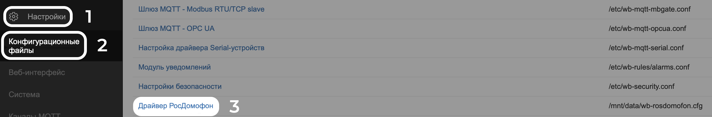
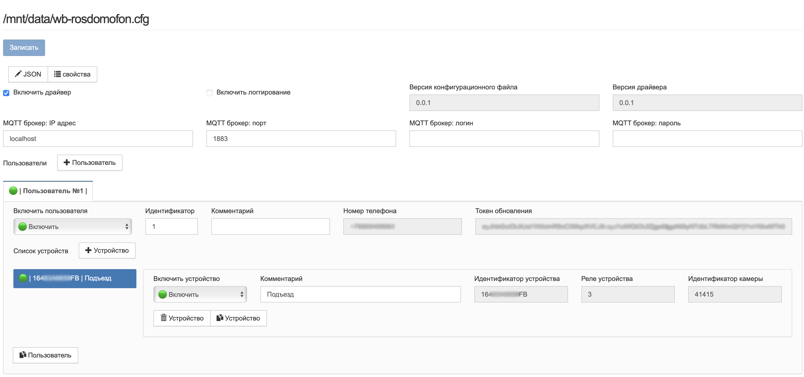
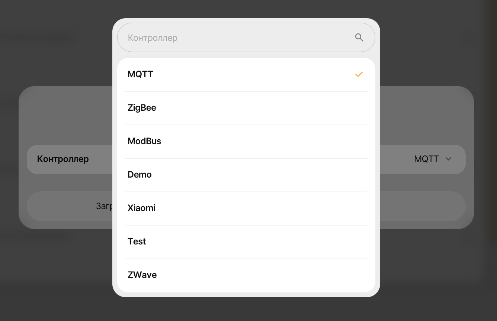
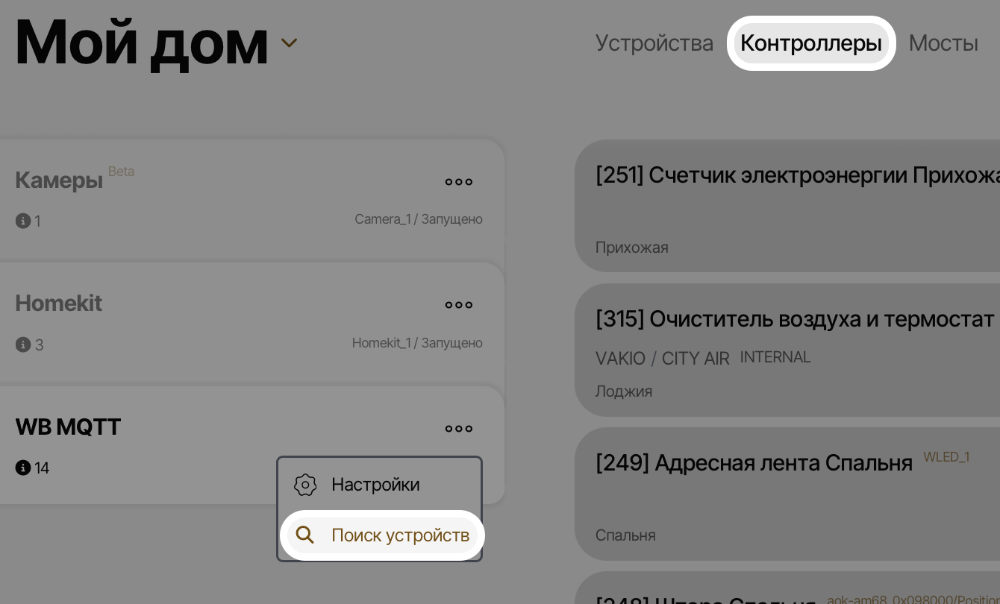

# WB-ROSDOMOFON
Драйвер для интеграции сервиса РосДомофон в ваш контроллер Wiren Board

## Навигация
- [Описание](#описание)
- [Установка](#установка)
- [Удаление](#удаление)
- [Авторизация](#авторизация)
  - [Параметры пользователя](#параметры-пользователя)
  - [Домофон с камерой](#домофон-с-камерой)
- [Конфигурационный файл](#конфигурационный-файл)
- [Интеграция в SprutHub](#интеграция-с-spruthub)
  - [Замок](#добавление-замка)
  - [Камера](#добавление-камеры)
  - [Пример отображения](#отображение-в-spruthub)

## Описание
WB-ROSDOMOFON - это проект для интеграции сервиса РосДомофон с контроллерами Wiren Board.

Сервис позволяет:
- Открывать двери / ворота / калитки / шлагбаумы
- Получать RTSP ссылки для просмотра камер
- Редактировать настройки пользователя:
  - Заглушить звонки
  - Заглушить уведомления от чатов
 
Планируется к добавлению: 
- Определение вызова
- Функция автофахтера / курьера. (Автоматическое открытие двери при звонке в квартиру)
---
Взаимодействие с РосДомофон: [РосДомофон API](https://rdba.rosdomofon.com/swagger-ui.html?urls.primaryName=abonents) <br>
MQTT топики формируются согласно [Wiren Board MQTT Conventions](https://github.com/wirenboard/conventions/tree/main)

## Установка
1) Подключаемся к контроллеру Wiren Board по SSH. <br>
`По умолчанию логин: root | пароль: wirenboard`
2) Копируем и вставляем команду:
```bash
curl -fsSL https://raw.githubusercontent.com/VolchkovVlad/wb-rosdomofon/main/install.sh | sh
```

## Удаление
1) Подключаемся к контроллеру Wiren Board по SSH. <br>
`По умолчанию логин: root | пароль: wirenboard`
2) Переходим в директорию 
```bash
cd /mnt/data/wb-rosdomofon
```
3) Вызываем файл удаления 
```bash
./uninstall.sh
```
## Авторизация
Для авторизации, необходимо открыть вкладку "Устройства" веб интерфейс контроллера Wiren Board.
<p align="left">
  
</p>

1) Введите номер телефона привязанный к аккаунту (Можно вводить начиная с 8 скрипт подправит на +7)
2) Нажимаете `Отправить SMS` (Если запрос отработал корректно, кнопка изменится на `✅ SMS | Повтор через 60 сек.`)
3) Введите полученый код подтверждения
4) Нажимаете `Отправить код`

При успешной авторизации, контролы для входа удалятся автоматически, а на их месте появится информация о пользователе: 
   
### Параметры пользователя
<p align="left">
  
</p>

Отображаемые параметры:
- Количество устройств
- Прочитать настройки пользователя <br>
К сожалению "подписаться" на изменения этих параметров мы не можем.  <br>
Поэтому вынуждены запрашивать принудительно, а что бы не спамить на сервер, делаем это только в ручном режиме.
- Настройки: Заглушить звонки
- Настройки: Заглушить чаты
- Токен обновлен 
Будет удален в будущем
- Токен доступа 
Будет удален в будущем, на данный момент используется для ускорения разработки

### Домофон с камерой
<p align="left">
  
</p>

Отображаемые параметры:
- Статус замка
  Возможные значения:
  - 0: Открыт
  - 1: Закрыт
  - 2: Зажат
  - 3: Не известен
- Замок
  Возможные значения:
  - 0: Открыть
  - 1: Закрыть
- Камера
  - Ссылка на RTSP поток с камеры: Логин и пароль уже встроены в ссылку

## Конфигурационный файл
Конфигурационный файл хранит в себе информацию о всех добавленных пользователях РосДомофон. Позволяет "Отключать" устройства (Полезно когда нужно скрыть отображение некоторых устройтсв). И подключаться к другому MQTT Брокеру, например установленному на другом контроллере Wiren Board.


Для открытия конфигурационного файла необходимо в веб интерфейсе контроллера Wiren Board:
1) Открыть настройки
2) Вкладка конфигурационные файлы
3) Драйвер РосДомофон



## Интеграция с SprutHub
---
### Добавление замка

1. Скачиваем шаблон для замка:  [Шаблон для версии SprutHub 1.12.8](examples/SprutHub_lock.json)  
   Для более новых версий SprutHub вероятно потребуется обновить шаблон:  [Сервис для создания / обновления шаблонов](https://kirillashikhmin.github.io/sht/editor/)

2. Открываем веб-интерфейс SprutHub одним из способов:
   - [web.spruthub.ru](https://web.spruthub.ru)
   - `<IP контроллера с SH>:7777`

<p align="center">
  
</p>

3. Открываем вкладку «Каталог»
4. В правом верхнем углу нажимаем «+»

<p align="left">
  
</p>

5. В списке выбираем «MQTT»
6. Загружаем шаблон файлом либо вставляем содержимое вручную

<p align="left">
  
</p>

7. Открываем вкладку «Контроллеры»
8. Запускаем поиск устройств в MQTT-контроллере

---
### Добавление камеры
1) Открываем веб-интерфейс SprutHub одним из способов:
   - [web.spruthub.ru](https://web.spruthub.ru)
   - `<IP контроллера с SH>:7777`
2) Открываем вкладку "Контроллеры"
3) В правом верхнем углу нажимаем "+"
4) Нажимаем "+ Добавить расширение"
5) В списке выбираем "Камеры" (RTSP/ONVIF)
6) Открываем настройки контроллера "Камеры"
7) Вводим: RTSP ссылку, логин и пароль 
---
### Отображение в SprutHub

## Похожие проекты
- rosdomofon-ha: https://github.com/iljyxa/rosdomofon-ha тот же функционал, но для использования с Home Assistant
