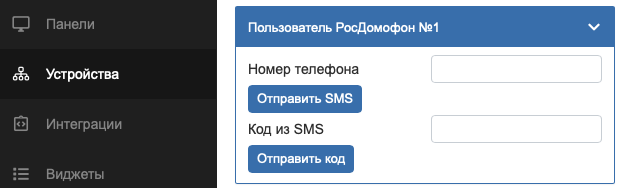
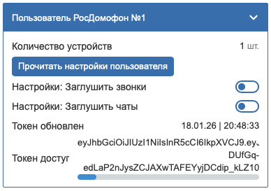
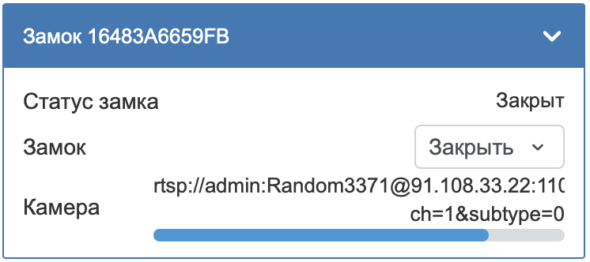

# WB-ROSDOMOFON
Драйвер для интеграции сервиса РосДомофон в ваш контроллер Wiren Board

## ОПИСАНИЕ
WB-ROSDOMOFON - это проект для интеграции сервиса РосДомофон с контроллерами Wiren Board.
Сервис позволяет:
- Открывать двери / ворота / калитки / шлагбаумы
- Получать RTSP ссылки для просмотра камер
- Редактировать настройки пользователя:
  - Заглушить звонки
  - Заглушить уведомления от чатов
Планируется к добавлению: 
- Определение вызова
- Функция автофахтера / курьера. (Автоматическое открытие двери при звонке в квартиру)

Для взаимодействия с сервисом РосДомофон используется 
- API: https://rdba.rosdomofon.com/swagger-ui.html?urls.primaryName=abonents

Для взаимодействия с контроллером Wiren Board используется протокол MQTT.
- Топики формируются согласно Wiren Board MQTT Conventions: https://github.com/wirenboard/conventions/tree/main

## УСТАНОВКА
1) Подключаемся к контроллеру Wiren Board по SSH. По умолчанию логин: root | пароль: wirenboard
2) Вводим команду 
```bash
curl -fsSL https://raw.githubusercontent.com/VolchkovVlad/wb-rosdomofon/main/install.sh | sh
```
3) Если ```[wb-rosdomofon] Installation completed``` значит установка завершена, можно отключаться от SSH.

## УДАЛЕНИЕ
1) Подключаемся к контроллеру Wiren Board по SSH. По умолчанию логин: root | пароль: wirenboard
2) Переходим в директорию 
```bash
cd /mnt/data/wb-rosdomofon
```
3) Вызываем файл удаления 
```bash
./uninstall.sh
```

## ВХОД В АККАУНТ
### Для продолжения работы, необходимо войти в свою учетную запись.
1) Открываем веб интерфейс контроллера Wiren Board и переходим на вкладку "Устройства"

1) Ввводите номер телефона (Можно вводить начиная с 8 и с +7 скрипт подправит на +7)
2) Нажимаете отправить SMS
3) Вводите полученый код подтверждения
4) Нажимаете отправить код
   
### Отображение параметров пользователя

Отображаемые параметры:
- Количество устройств
- Прочитать настройки пользователя
- Настройки: Заглушить звонки
- Настройки: Заглушить чаты
- Токен обновлен
- Токен доступа

### Отображение домофона с камерой

Отображаемые параметры:
- Статус замка
  Возможные значения:
  - 0: Открыт
  - 1: Закрыт
  - 2: Зажат
  - 3: Не известен
- Замок
  Возможные значения:
  - 0: Открыть
  - 1: Закрыть
- Камера
  - Ссылка на RTSP поток с камеры: Логин и пароль уже встроены в ссылку

## ИНТЕГРАЦИЯ С SprutHub
### Интеграция замка
1) Скачиваем шаблон для замка (Шаблон актуален для версии SH 1.12.8 Для более новых версий возможно потребуется обновить шаблон):
2) Открываем веб интерфейс SprutHub
3) Открываем вкладку "Каталог"
4) В правом верхнем углу нажимаем "+"
5) В выпдающим спике выбираем "MQTT"
6) Загружаем файлом либо копируем содержимое и вставляем.
7) Открываем вкладку "Контроллеры"
8) Запускаем поиск устройтсв в контроллере MQTT

### Камера
1) Открываем веб интерфейс SprutHub. Одним из двух способов:
- web.spruthub.ru
- <IP Контроллера с SH>:7777
2) Открываем вкладку "Контроллеры"
3) В правом верхнем углу нажимаем "+"
4) Нажимаем "+ Добавить расширение"
5) В списке выбираем "Камеры" (RTSP/ONVIF)
6) Открываем настройки контроллера "Камеры"
7) Вводим: RTSP ссылку, логин и пароль 

### Отображение в SprutHub

## ПОХОЖИЕ ПРОЕКТЫ
- rosdomofon-ha: https://github.com/iljyxa/rosdomofon-ha тот же функционал, но для использования с Home Assistant
